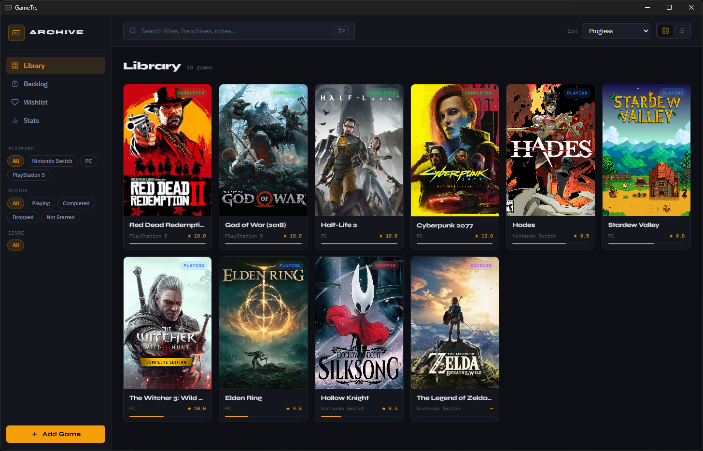

# GameTrc

GameTrc is a desktop application for tracking and managing your video game library. Built with [Tauri](https://tauri.app/) and SQLite, it provides a sleek, native interface to catalog games, monitor progress, and visualize your gaming habits.



## Features

- **Complete Game Library Management**  
  Add, edit, and delete games with rich metadata:
  - Title, franchise, sequence number
  - Platform, release date, developer, publisher
  - Status (Not Started, Playing, Completed, Dropped, Backlog, Wishlist)
  - Progress percentage, playtime (hours), rating (1–10)
  - Notes, cover art, screenshots, multiple genres

- **Powerful Search & Filtering**  
  Quickly find games by title, franchise, notes, status, platform, genre, or minimum rating.  
  Filters persist across views and can be combined.

- **Multiple Views**  
  - **Library**: All games (filtered by sidebar selections)  
  - **Backlog**: Games marked as "Backlog"  
  - **Wishlist**: Games marked as "Wishlist"  
  - **Stats**: Dashboard with aggregated statistics

- **Sorting & Display Options**  
  Sort games by title, release date, rating, playtime, progress, or last update (ascending/descending).  
  Toggle between grid and list views.

- **Statistics Dashboard**  
  Get insights at a glance:
  - Total games, total playtime, average rating, completion rate
  - Breakdown by status, platform, genre, franchise
  - Recently completed games

- **Responsive, Dark‑mode UI**  
  A carefully crafted dark theme with smooth animations, custom scrollbars, and a sidebar that adapts to the active view.

- **Cross‑Platform**  
  Runs natively on Windows, macOS, and Linux thanks to Tauri.

## Built With

- **[Tauri](https://tauri.app/)** – Lightweight framework for building desktop apps with a Rust backend and any frontend.
- **[Rust](https://www.rust-lang.org/)** – Backend logic, database operations, and IPC commands.
- **[SQLite](https://www.sqlite.org/)** – Embedded database for storing game data (via `rusqlite`).
- **Vanilla HTML / CSS / JavaScript** – No frontend framework; minimal, fast, and dependency‑free.
- **[Tauri Plugins](https://tauri.app/plugins/)** – Used for file dialogs (`dialog`), file system access (`fs`), and opening files/URLs (`opener`).

## Getting Started

### Prerequisites

- **Rust** (install via [rustup](https://rustup.rs/))
- **Tauri CLI** – Install with `cargo install tauri-cli`
- **System Dependencies** – Follow the [Tauri prerequisites guide](https://tauri.app/start/prerequisites/) for your OS (e.g., WebView2 on Windows, `webkit2gtk` on Linux).

### Installation

1. Clone the repository:
   ```bash
   git clone https://github.com/HushmKun/GameTrc.git
   cd gametrc
   ```

2. Build and run in development mode:
   ```bash
   cargo tauri dev
   ```
   This will launch the application with hot‑reload for the frontend.

3. To create a production build:
   ```bash
   cargo tauri build
   ```
   The bundled installer/executable will be placed in `src-tauri/target/release/` or `src-tauri/target/release/bundle/`.

### Database Location

GameTrc stores its SQLite database in your operating system’s standard application data directory:

- **Windows:** `%APPDATA%\gametrc\games.db`
- **macOS:** `~/Library/Application Support/gametrc/games.db`
- **Linux:** `~/.local/share/gametrc/games.db`

The database is automatically created when you first run the app.

## Usage

1. **Add a Game** – Click the **Add Game** button in the sidebar. Fill in the details (title and platform are required). Use the star rating, genre tags, and cover art drop zone for richer entries.
2. **Manage Your Library** – Use the sidebar filters (platform, status, genre) and the top search bar to narrow down games. Click any game card to open a detailed view with edit/delete options.
3. **Track Progress** – Update the progress slider or playtime as you play. The dashboard will reflect your stats.
4. **Explore Statistics** – Switch to the **Stats** view to see charts and breakdowns of your collection.

## Configuration

The application’s window size, title, and permissions are defined in `src-tauri/tauri.conf.json`. You can adjust these to suit your needs.

The security policy allows loading images from common user directories (`$PICTURE`, `$DOWNLOAD`, etc.) so cover art and screenshots can be displayed from anywhere on your system.

## Contributing

Contributions are welcome! If you’d like to add a feature or fix a bug:

1. Fork the repository.
2. Create a feature branch (`git checkout -b feature/amazing-feature`).
3. Commit your changes (`git commit -m 'Add some amazing feature'`).
4. Push to the branch (`git push origin feature/amazing-feature`).
5. Open a Pull Request.

## License

This project is licensed under the MIT License – see the [LICENSE](LICENSE) file for details (if included).

## Acknowledgements

- [Tauri](https://tauri.app/) for the fantastic framework.
- [IBM Plex](https://www.ibm.com/plex/) font family.